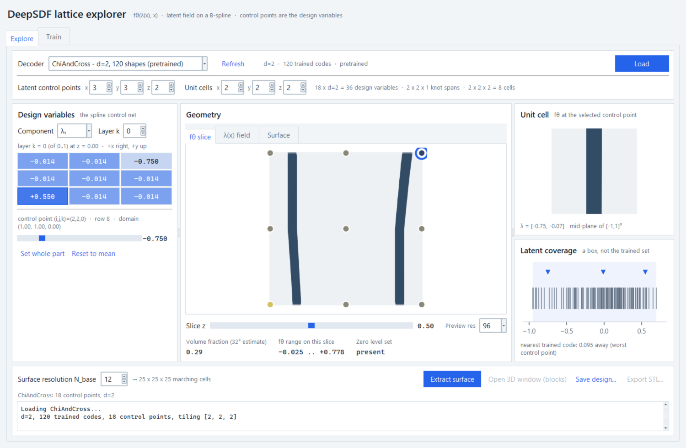
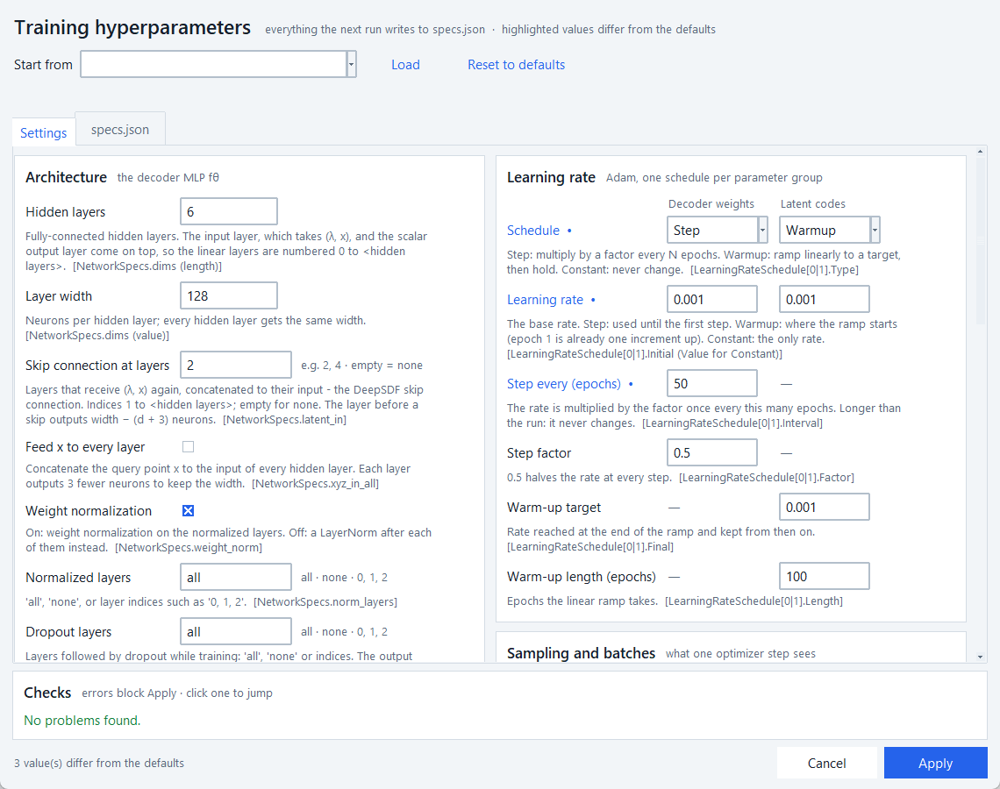

# The GUI — what each panel is, and why it is there

Two windows, deliberately separate:

```bash
uv run python -m structsept.app.main        # explorer: Explore, Explore 2-D, Train
uv run python -m structsept.app.sdf_maker   # dataset builder, run once in a while
```

The explorer assumes valid SDF datasets already exist on disk. Building them is
a different job with a different rhythm, so it lives in its own window and kept
its old, unstyled layout — only its text is English now. Parametric datasets
(the plate with a hole) come from the `datagen` package instead:
`uv run python -m datagen.make_plate_hole --dim 2`.



---

## The idea the interface has to carry

From `paper_context.md` (Kofler et al. 2025): the unit-cell geometry is a
trained DeepSDF decoder `f_θ`. Its latent vector is allowed to vary in space as
a B-spline field `λ(x) = Σᵢ φᵢ(x) λ̂ᵢ`, and the spline control points `λ̂ᵢ` **are
the design variables** of the optimization. A transformation function `T(x)`
tiles the cell over the domain. Compliance is minimized subject to a volume
constraint; MMA moves `λ̂`.

So the explorer is a hand-driven version of one optimizer iteration. Every
panel answers one question in that chain:

| Question | Where it is answered |
|---|---|
| Which `f_θ` do I have, and is it usable? | header: `d`, number of trained codes, source |
| How many design variables, how many cells, are the two independent? | header: derived readout |
| Which knob moves which region? | left: the control net, laid out in space |
| What shape is this *now*? | centre: `f_θ` slice |
| How much material is there? | centre: volume fraction |
| What does this latent number *mean*? | right: the bare unit cell |
| Is the design still supported by training? | right: latent coverage |

---

## Panel by panel

**Header — decoder and grid.** The derived line spells out the decoupling the
paper makes a point of: `18 × d=2 = 36 design variables · 2×2×1 knot spans ·
2×2×2 = 8 cells`. The number of control points is independent of the number of
unit cells (Eq. 21); two identical-looking spinbox triples hid that. The header
also warns when a decoder's stored latent codes are all identical — the
`Primitives*` nets ship exact zeros, which used to give every slider ±0.0001 of
travel with no explanation.

**Left — design variables.** The control net is drawn as an `nx × ny` grid for
one layer `k` and one component `λⱼ`, with row 0 at the bottom so the grid
matches the slice beside it. Screen position = domain position: cell `(i,j)`
sits at `(i/(nx−1), j/(ny−1))`. The flat row index into `λ̂` is
`i + nx·(j + ny·k)`, and the caption states it, so the array and the picture
agree. A cell outlined in red is outside the trained range.

This replaces a flat list of `cp0 λ₁` sliders. That list threw away the index's
spatial meaning and did not scale: at the spinbox maxima it is 216 control
points × `d` rows, built synchronously. The grid shows at most 36 cells whatever
`d` and `nz` are, and one slider edits the selected one.

**Centre — geometry.** Three pages: the `f_θ` slice, the `λ(x)` field, and the
extracted surface. Under them, the slice height `z`, the preview resolution, and
three numbers: volume fraction, the `φ` range on this slice, and whether a zero
level set exists at all. Volume fraction is `V(λ̂)`, the paper's constraint — the
one scalar that ties this toy to the optimization it feeds. It is a 32³
midpoint-rule estimate on **cell centres**: a node grid would put 27 % of its
samples on the domain faces, where the border cap forces `φ ≥ 0`, and report
every lattice as about a third emptier than it is. Even at 32³ the thin struts
are only just resolved, so read it to two decimals, not three. "Zero level set:
absent" is the honest early warning for the empty-mesh case.

The control points of the active layer are drawn on the slice. That makes the
B-spline's **local support** checkable rather than something to take on faith:
move one marker and only its neighbourhood of the lattice responds.

**Right — what the numbers mean.** The *unit cell* panel shows
`f_θ(λ̂_selected, ·)` on the bare cube `[−1,1]³`, before tiling. This matters
because a latent value is not a physical parameter: for the trained
`RoundCross` the codes were learned, not prescribed, so `λ = 0.6` is not a
radius. The picture is the only honest interpretation of the number.

The *latent coverage* strip shows, for the active component, every trained code
as a tick, the min/max band shaded, the widest untrained gap in amber, and the
current `λ̂` values as markers. Below it: the distance from the worst control
point to the nearest trained code.

---

## What was removed, and why

**The latent point cloud (`λ₁` vs `λ₂` scatter) is gone.** Of the seven shipped
decoders only one has `d = 2`, so for six of them the panel rendered a
placeholder string. Even at `d = 2` it was a cloud of grey dots that answered no
question anyone had, and its convex hull actively lied: it shaded untrained
interior as supported.

The coverage strip is its honest replacement — same data, one dimension at a
time, readable for any `d`, and it shows the gaps the hull hid. On `RoundCross`
it shows a 0.40-wide hole in the middle of the trained range, with the app's
default design (the mean of the codes, 0.115) sitting inside it. That is why the
default lattice comes out thin. The old status line reported
zero values out of range, because the mean *is* inside the bounding box.

The scatter does come back once, on the Explore 2-D tab, in a form that answers
a question: there every dot is coloured by the parameter that generated its
shape, and that colouring is the whole point of the view.

---

## Rendering decisions worth not undoing

**The SDF slice is material/void, not a diverging colour map.** The old panel
used `seismic` rescaled to `max|φ|` every frame. Two problems: `φ` saturates at
+1 over most of the domain, so the material got about a tenth of the ramp and
rendered as a pale smudge — worse the thinner the struts; and the normalization
moved *while* the geometry moved, so colour and shape changed together. The
magnitude of `φ` away from the surface is an artefact of the SDF construction
anyway, and the network is only accurate near the zero set. What the panel has
to answer during a drag is `sign(φ)`. The transition is anti-aliased over ~1
screen pixel, with the width derived from the measured `|∇φ|` (3.9 for
`AnalyticRoundCross`, 0.85 for `ChiAndCross` — `T(x)` rescales the gradient, so
it cannot be assumed to be 1).

**The `λ(x)` panels use a fixed normalization per component** — the trained
range, stated in each panel title. Autoscaled per frame, the starting design (a
constant field with ~1e-8 of float round-off) rendered that round-off as
full-contrast signal. Now a constant field says `constant −0.070`. Scales are
per component, not shared: DeepSDF latent dimensions are not commensurable.

**Two redraw tiers.** Geometry follows the drag at 120 ms; the latent field, the
unit cell, the coverage strip and the volume fraction wait 400 ms for it to
stop. Measured: `f_θ` eval+draw ≈ 38 ms, the `λ(x)` panel ≈ 89 ms rebuilt and
~20 ms updated in place, the volume grid ≈ 100 ms. Panels are updated in place
and the constrained layout is solved once and pinned, re-solved only on a
debounced resize.

---

## Explore 2-D tab

A decoder trained on **2-D samples** `(x, y, φ)` — the `datagen` plate with a
hole — is `f_θ(λ, x, y)`: one latent vector is one whole shape in the plane.
There is no unit cell to tile and no latent field over a domain, so the Explore
tab does not apply; it lists only 3-D decoders, and planar ones appear here.

The experiment behind it: the plates were drawn from three parameters
`(x_c, y_c, r)`, the network never saw them and learned its own `d`-dimensional
code per plate. Which of the three did the codes keep? The panels answer that:

| Panel | What it shows |
|---|---|
| **Latent space** (left) | one dot per training shape at its learned code, coloured by `x_c`, `y_c`, `r` or the fit error. Click or drag to move `λ`; the red cross is the current `λ`, the amber ring the nearest trained shape. For `d > 2`, pick the pair of components to plot. |
| **Shape** (centre) | `f_θ(λ, ·)` on `[-1, 1]²` as material/void, with the nearest training shape's *stored* near-surface samples in amber on top — the true boundary the decoder was supposed to reproduce. Tiles: which shape is nearest, how far in latent units, its per-shape fit error, material share. The status line warns when `λ` sits more than twice the typical code spacing away from every trained code: extrapolation. |
| **What the codes kept** (right) | the same cloud once per parameter, side by side, plus the fit error. Each title carries an `R²`: leave-one-out nearest-neighbour regression of the parameter from the codes. Near 1, close codes mean close parameter values — kept. Near 0 or below, lost. Unlike a linear fit it does not care how the parameter is laid out. |

Where the numbers come from: the run's `LatentCodes/latent_code_data_map.json`
gives the `.npz` behind each code, in latent order; `params.csv` next to the
dataset (written by `datagen`) is joined on the instance name. The fit error is
the clamped L1 between `f_θ(λᵢ, ·)` and the stored samples of shape `i` — the
training loss, per shape. A run without a parameter table still loads; only
the colouring is missing.

---

## Train tab

Dataset picker with a readiness badge that states the shapes-per-dimension
problem *before* the run instead of logging it afterwards (`d ≥ 2` with fewer
than 40 shapes: the paper used 120). Architecture and budget, a live loss curve
read from the run's own `Logs.pth` checkpoint on a 1.5 s Tk timer — the worker
thread is inside the trainer for the whole run and cannot report anything — and
a table of past runs; double-click opens one in the Explore tab, or in Explore
2-D for a planar run.

**The dataset decides the decoder's input.** Each dataset in the picker says
`2-D` or `3-D` — from `datagen`'s `dataset.json` when there is one, from the
width of the stored rows otherwise. A 2-D set trains `f_θ(λ, x, y)`
(`geom_dimension` 2 in `specs.json`), a 3-D one the usual unit cell. It is not a
setting: a mismatch between the specs and the rows kills the trainer on its
first batch with an `IndexError`, so it is read from the data, never typed.

The Decoder card keeps the four values changed most often — `d`, hidden layers,
width, epochs — as spinboxes. Under them, one line says which of the *other*
hyperparameters differ from the defaults ("Changed: decoder lr 0.001 · loss
huber"), or, in red, why the current set cannot be trained. Train refuses such
a set with the reason instead of crashing a few minutes into the run.

### The hyperparameter window



"All hyperparameters..." opens a window with **every `specs.json` key the
DeepSDF trainer reads**, grouped as the trainer uses them: architecture, latent
codes, loss, the two learning-rate schedules, sampling and batches, budget and
checkpoints. Each row carries a sentence on what the value does to `f_θ` and
the `specs.json` key it lands in. The schema behind it is
`structsept/app/hyperparams.py`: one `Field` per value, and the window, the card
summary and `training.write_specs` are all built from it.

- **It edits a draft.** Nothing reaches the card until Apply, and Apply stays
  grey while anything is an error. The four card values are the same values in
  both places. The window holds the input grab, so the card cannot change
  underneath it.
- **Checks run as you type.** Errors are combinations the library crashes on,
  each confirmed against the real code: an odd `SamplesPerScene`, a skip
  connection at layer 0 or at `layers + 1`, `width ≤ d + 3` with a skip, a
  `LogFrequency` longer than the run. Warnings are legal but almost certainly
  unintended (a batch larger than the dataset, `tanh` output with `δ ≥ 1`).
  Notes explain an effect that is easy to misread, such as the default step
  schedule never decaying in a 200-epoch run. Clicking a line jumps to the
  field.
- **The learning-rate card is a table.** The trainer's Adam has two parameter
  groups, decoder weights and latent codes, and gives each its own schedule
  (`Step`, `Warmup` or `Constant`). A row the chosen type does not use shows a
  dash, and disappears when neither column needs it.
- **"Start from"** loads the settings of a local run or of a shipped decoder
  (`ChiAndCross`, `Primitives2D`, …) into the draft. Whatever could not be
  carried over — another architecture, non-uniform layer widths — is said in
  the status line, not dropped silently.
- **The `specs.json` page** renders the file the next run will write, from the
  draft. It answers "what exactly will the trainer see?" without starting a
  run.
- **"Not editable here"** lists what the window cannot change and why. Some
  values the app pins: the CPU, no data-loader processes, the
  `deep_sdf_decoder` architecture. Others the trainer hardcodes whatever the
  file says: gradient clipping at 1.0 (`GradientClipNorm` is read, then
  overwritten) and the 100-epoch ramp of the code regularization.

With every value at its default, the window writes exactly the `specs.json` the
app wrote before it existed. The test suite pins that.

---

## Tests

`tests/test_app_explore.py` drives the real widgets off-screen. Each test is a
defect that shipped once: the context column freezing on a resolution change,
an unclamped layer spinbox indexing past the design vector, a stale mesh
surviving a design edit, two threads on one SDF, and the volume fraction's node
-grid bias.

`tests/test_app_hyperparams.py` covers the hyperparameter window from the
schema up. Every set the validator accepts builds a working `DeepSDFDecoder`,
and every architecture the decoder rejects is refused by the validator. One
four-epoch run on two synthetic spheres checks that the learning rates the
trainer logged, the checkpoints it kept and the layer shapes it saved are the
values typed into the window. The window itself is driven off-screen.

`tests/test_app_explore2d.py` runs the planar path end to end on a 6-shape
`datagen` plate set: the dataset is recognised as 2-D, a two-epoch throwaway run
is trained by the Train tab's own code, lands on Explore 2-D and not on Explore,
and the map, slider, colouring and snap are driven off-screen.
`tests/test_datagen.py` covers the generator itself — the field against a
brute-force distance, the file contract, overwrite safety. Run them with the
rest:

```bash
uv run pytest tests/ -q
```

---

## Known limits

- The trained-range test is a per-component bounding box. For `d ≥ 2` that box
  is not the trained set; the nearest-code distance is there because of it.
- `Primitives*` decoders carry their shape information outside the stored latent
  codes, so the coverage panel is uninformative for them. The header says so.
- The 3-D preview is a flat-shaded, depth-sorted `Poly3DCollection`. It is
  static: "Open 3D window" still gives the real pyvista view, and that one
  still blocks the interface until closed — VTK needs the main thread.
- The extracted surface belongs to the design it came from. Moving any control
  point drops it, and Export STL goes grey until you extract again.
- Extraction and the interface share one SDF object, and `LatticeSDFStruct`
  writes a latent vector per query point into its microtile, so whoever
  queries second gets a shape mismatch. The design and view panels are
  disabled and pending redraws are cancelled while the mesher runs.
- The SDF maker reads its mesh folder on the Tk thread, so it freezes while
  loading a large folder. Pre-existing, and kept as-is with the rest of it.
- Explore 2-D shows the field, not a mesh: there is no surface extraction or
  STL export for planar decoders yet. Its `R²` needs a handful of shapes per
  neighbourhood to mean anything; on a few dozen shapes it is noisy.
